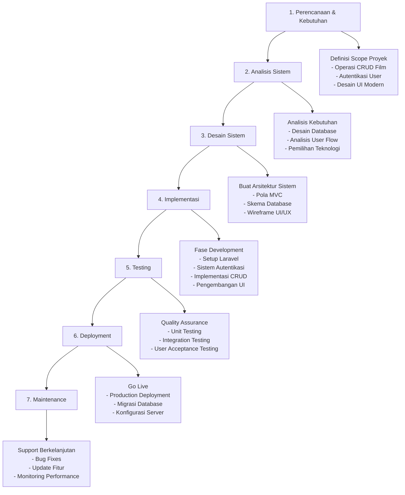
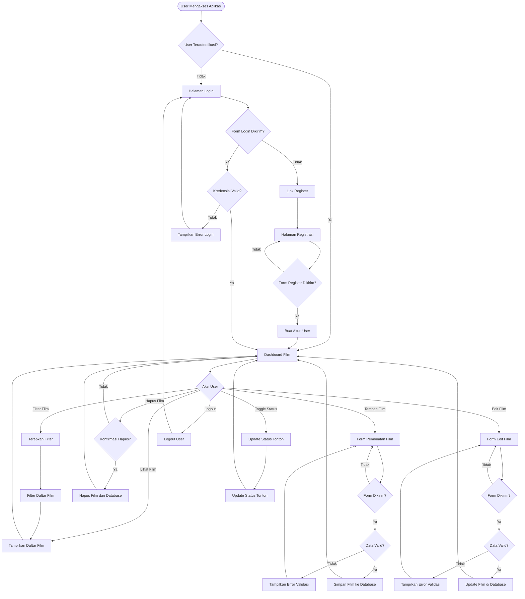

# 🎬 Sistem Manajemen Koleksi Film

Sistem manajemen koleksi film modern dengan fitur autentikasi dan antarmuka yang responsif. Dibangun menggunakan Laravel 12 dengan design system yang konsisten dan user experience yang optimal.

## 📋 Daftar Isi

- [Fitur](#fitur)
- [Teknologi yang Digunakan](#teknologi-yang-digunakan)
- [Entity Relationship Diagram (ERD)](#entity-relationship-diagram-erd)
- [System Development Life Cycle (SDLC)](#system-development-life-cycle-sdlc)
- [Flowchart Aplikasi](#flowchart-aplikasi)
- [Instalasi](#instalasi)
- [Setup Database](#setup-database)
- [Cara Penggunaan](#cara-penggunaan)
- [Dokumentasi API](#dokumentasi-api)
- [Screenshot](#screenshot)
- [Kontribusi](#kontribusi)
- [Lisensi](#lisensi)

## ✨ Fitur

### 🎯 Fitur Utama
- **Operasi CRUD Lengkap** - Create, Read, Update, Delete film
- **Filter Lanjutan** - Filter berdasarkan genre, rating, dan status tonton
- **Upload Gambar** - Upload dan kelola poster film
- **Tracking Status Tonton** - Tandai film sebagai sudah/belum ditonton
- **Fungsi Pencarian** - Cari film berdasarkan judul

### 🔐 Fitur Autentikasi
- **Registrasi User** - Pembuatan akun user yang aman
- **Login User** - Autentikasi berbasis session
- **Proteksi Password** - Penyimpanan password terenkripsi
- **Manajemen Session** - Logout aman dan pengelolaan session

### 🎨 Fitur UI/UX
- **Desain Modern** - UI kontemporer dengan gradien dan animasi
- **Layout Responsif** - Berfungsi di desktop dan mobile
- **Sidebar Collapsible** - Navigasi yang efisien ruang
- **Kartu Profesional** - Tampilan kartu film yang indah
- **Loading States** - Feedback visual untuk aksi user

## 🛠 Teknologi yang Digunakan

| Kategori | Teknologi |
|----------|------------|
| **Backend** | Laravel 12 (PHP 8.2+) |
| **Frontend** | Blade Templates, Custom CSS |
| **Database** | SQLite |
| **Autentikasi** | Laravel Auth (Custom Implementation) |
| **File Storage** | Laravel Storage |
| **Asset Building** | Vite |
| **Styling** | Custom CSS dengan CSS Variables |
| **Icons** | Emoji Icons |

## 📊 Entity Relationship Diagram (ERD)

```mermaid
erDiagram
    users {
        bigint id PK
        varchar name "255"
        varchar email "255" UK
        timestamp email_verified_at
        varchar password "255"
        varchar remember_token "100"
        timestamp created_at
        timestamp updated_at
    }
    
    films {
        bigint id PK
        varchar title "255"
        varchar genre "100"
        integer year
        decimal rating "3,1"
        boolean watched
        varchar image "255"
        bigint user_id FK
        timestamp created_at
        timestamp updated_at
    }
    
    users ||--o{ films : owns
```

### Relasi Database
- **One-to-Many**: Satu user dapat memiliki banyak film
- **Foreign Key**: `films.user_id` mereferensi `users.id`
- **Constraints**: Email harus unik, rating antara 0.0-10.0

## 🔄 System Development Life Cycle (SDLC)



### Detail Fase SDLC

| Fase | Durasi | Aktivitas Utama | Deliverables |
|-------|----------|----------------|--------------|
| **Perencanaan** | Minggu 1 | Gathering requirements, definisi scope proyek | Dokumen Requirements |
| **Analisis** | Minggu 1-2 | Analisis sistem, studi kelayakan | Dokumen Analisis Sistem |
| **Desain** | Minggu 2 | Desain database, wireframe UI, arsitektur | Spesifikasi Desain |
| **Implementasi** | Minggu 2-3 | Coding, pengembangan fitur | Aplikasi yang Berfungsi |
| **Testing** | Minggu 3 | Unit testing, integration testing | Laporan Testing |
| **Deployment** | Minggu 3 | Setup produksi, go-live | Aplikasi Live |
| **Maintenance** | Berkelanjutan | Bug fixes, updates, support | Log Maintenance |

## 🔀 Flowchart Aplikasi



### Alur Perjalanan User

1. **Alur Autentikasi**
   - User mengakses aplikasi
   - Diarahkan ke login jika belum terautentikasi
   - Opsi untuk registrasi akun baru
   - Login berhasil menuju dashboard

2. **Alur Manajemen Film**
   - Lihat semua film dengan opsi filter
   - Buat entri film baru dengan upload gambar
   - Edit informasi film yang ada
   - Hapus film dengan konfirmasi
   - Toggle status tonton secara instant

3. **Alur Validasi Data**
   - Validasi client-side untuk feedback cepat
   - Validasi server-side untuk keamanan
   - Tampilan error dengan informasi field spesifik
   - Pesan sukses untuk aksi yang selesai

## 🚀 Instalasi

### Prasyarat

- PHP 8.2 atau lebih tinggi
- Composer
- Node.js & NPM
- SQLite3

### Langkah-langkah Instalasi

1. **Clone Repository**
```bash
git clone <repository-url>
cd daftarfilm
```

2. **Install Dependencies PHP**
```bash
composer install
```

3. **Install Dependencies Node**
```bash
npm install
```

4. **Konfigurasi Environment**
```bash
# Copy file environment
cp .env.example .env

# Generate application key
php artisan key:generate
```

5. **Konfigurasi Environment Variables**
Edit file `.env`:
```env
APP_NAME="Sistem Manajemen Film"
APP_ENV=local
APP_KEY=base64:your-generated-key
APP_DEBUG=true
APP_TIMEZONE=UTC
APP_URL=http://localhost:8000

DB_CONNECTION=sqlite
DB_DATABASE=database/database.sqlite
```

6. **Buat Storage Link**
```bash
php artisan storage:link
```

7. **Build Assets**
```bash
npm run build
# atau untuk development
npm run dev
```

## 🗄 Setup Database

### 1. Buat Database SQLite
```bash
# Buat direktori database jika belum ada
mkdir -p database

# Buat file database SQLite
touch database/database.sqlite
```

### 2. Jalankan Database Migrations
```bash
# Jalankan semua migrations
php artisan migrate

# Opsional: Jalankan dengan seed data
php artisan migrate --seed
```

### 3. Gambaran Skema Database

#### Tabel Users
```sql
CREATE TABLE users (
    id INTEGER PRIMARY KEY AUTOINCREMENT,
    name VARCHAR(255) NOT NULL,
    email VARCHAR(255) UNIQUE NOT NULL,
    email_verified_at TIMESTAMP NULL,
    password VARCHAR(255) NOT NULL,
    remember_token VARCHAR(100) NULL,
    created_at TIMESTAMP DEFAULT CURRENT_TIMESTAMP,
    updated_at TIMESTAMP DEFAULT CURRENT_TIMESTAMP
);
```

#### Tabel Films
```sql
CREATE TABLE films (
    id INTEGER PRIMARY KEY AUTOINCREMENT,
    title VARCHAR(255) NOT NULL,
    genre VARCHAR(100) NOT NULL,
    year INTEGER NOT NULL,
    rating DECIMAL(3,1) NOT NULL,
    watched BOOLEAN DEFAULT FALSE,
    image VARCHAR(255) NULL,
    user_id INTEGER NOT NULL,
    created_at TIMESTAMP DEFAULT CURRENT_TIMESTAMP,
    updated_at TIMESTAMP DEFAULT CURRENT_TIMESTAMP,
    FOREIGN KEY (user_id) REFERENCES users(id) ON DELETE CASCADE
);
```

### 4. Konfigurasi Storage
```bash
# Pastikan direktori storage ada
mkdir -p storage/app/public/films

# Set permission yang tepat (Linux/Mac)
chmod -R 775 storage
chmod -R 775 bootstrap/cache
```

## 🎯 Cara Penggunaan

### Menjalankan Aplikasi

1. **Development Server**
```bash
php artisan serve
```
Aplikasi akan tersedia di `http://localhost:8000`

2. **Asset Development**
```bash
# Watch untuk perubahan
npm run dev

# Build untuk production
npm run build
```

### Panduan User

#### 1. **Registrasi & Login User**
- Akses `/register` untuk pembuatan akun baru
- Gunakan `/login` untuk user yang sudah ada
- Otomatis redirect ke dashboard setelah autentikasi

#### 2. **Mengelola Film**
- **Tambah Film**: Klik "Tambah Film" di sidebar
- **Lihat Film**: Dashboard utama menampilkan semua film dengan filter
- **Edit Film**: Klik tombol "Edit" di kartu film
- **Hapus Film**: Klik "Hapus" dengan dialog konfirmasi
- **Toggle Status Tonton**: Klik badge status tonton untuk toggle

#### 3. **Filter Film**
- **Berdasarkan Genre**: Pilih dari dropdown menu
- **Berdasarkan Rating**: Pilih threshold rating minimum
- **Berdasarkan Status Tonton**: Filter film yang sudah/belum ditonton
- **Reset Filter**: Hapus semua filter aktif

#### 4. **Manajemen Gambar**
- Upload gambar poster saat pembuatan/edit film
- Format yang didukung: JPG, JPEG, PNG, GIF
- Ukuran file maksimum: 2MB
- Gambar otomatis dioptimalkan dan disimpan

## 📡 Dokumentasi API

### Endpoint Autentikasi

| Method | Endpoint | Deskripsi | Parameter |
|--------|----------|-------------|------------|
| GET | `/login` | Tampilkan form login | - |
| POST | `/login` | Proses login | email, password, remember |
| GET | `/register` | Tampilkan form registrasi | - |
| POST | `/register` | Proses registrasi | name, email, password, password_confirmation |
| POST | `/logout` | Logout user | - |

### Endpoint Manajemen Film

| Method | Endpoint | Deskripsi | Parameter |
|--------|----------|-------------|------------|
| GET | `/films` | Daftar semua film | genre, rating, watched |
| GET | `/films/create` | Tampilkan form create | - |
| POST | `/films` | Simpan film baru | title, genre, year, rating, watched, image |
| GET | `/films/{id}` | Tampilkan detail film | - |
| GET | `/films/{id}/edit` | Tampilkan form edit | - |
| PUT/PATCH | `/films/{id}` | Update film | title, genre, year, rating, watched, image |
| DELETE | `/films/{id}` | Hapus film | - |
| PATCH | `/films/{id}/toggle-watched` | Toggle status tonton | - |

### Contoh Request

#### Buat Film
```bash
curl -X POST http://localhost:8000/films \
  -H "Content-Type: multipart/form-data" \
  -F "title=The Matrix" \
  -F "genre=Sci-Fi" \
  -F "year=1999" \
  -F "rating=9.0" \
  -F "watched=true" \
  -F "image=@poster.jpg"
```

#### Filter Film
```bash
curl "http://localhost:8000/films?genre=Action&rating=8&watched=true"
```

## 📸 Screenshot

### Halaman Login
- Background gradient modern
- Efek glass-morphism
- Desain responsif
- Validasi form

### Dashboard
- Navigasi sidebar collapsible
- Kartu film dengan hover effects
- Sistem filter lanjutan
- Bagian profil user

### Kartu Film
- Tampilan gambar poster
- Badge rating
- Indikator status tonton
- Tombol aksi

### Pembuatan/Edit Film
- Validasi form
- Preview upload gambar
- Error handling
- Feedback sukses

## 🤝 Kontribusi

### Workflow Development

1. **Fork Repository**
2. **Buat Feature Branch**
```bash
git checkout -b feature/fitur-baru
```

3. **Buat Perubahan**
- Ikuti standar coding Laravel
- Tulis kode yang bersih dan terdokumentasi
- Tambahkan test untuk fitur baru

4. **Test Perubahan**
```bash
# Jalankan test
php artisan test

# Cek code style
./vendor/bin/pint
```

5. **Submit Pull Request**
- Berikan deskripsi yang jelas
- Sertakan screenshot untuk perubahan UI
- Referensi issue terkait

### Standar Coding

- Ikuti standar coding PSR-12
- Gunakan nama variabel yang bermakna
- Tulis komentar yang komprehensif
- Pertahankan indentasi yang konsisten
- Ikuti best practices Laravel

### Melaporkan Issues

- Gunakan issue tracker
- Berikan langkah reproduksi yang detail
- Sertakan informasi sistem
- Lampirkan screenshot yang relevan

## 📄 Lisensi

Proyek ini adalah open-source software yang dilisensikan di bawah [MIT license](https://opensource.org/licenses/MIT).

## 👨‍💻 Author

**Sistem Manajemen Film**
- Dibangun dengan ❤️ menggunakan Laravel 12
- Desain UI/UX Modern
- Responsif & Accessible

---

### Perintah Quick Start

```bash
# Clone dan setup
git clone <repository-url>
cd daftarfilm
composer install
npm install
cp .env.example .env
php artisan key:generate
touch database/database.sqlite
php artisan migrate
php artisan storage:link
npm run build

# Mulai development
php artisan serve
npm run dev
```

Untuk informasi lebih detail, silakan merujuk ke bagian masing-masing di atas atau hubungi tim development.
